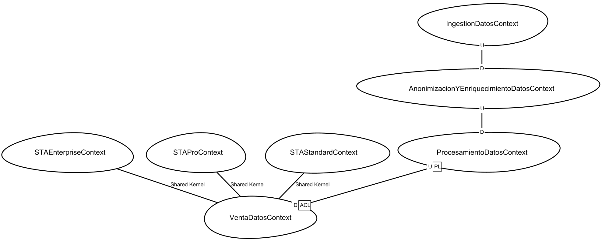
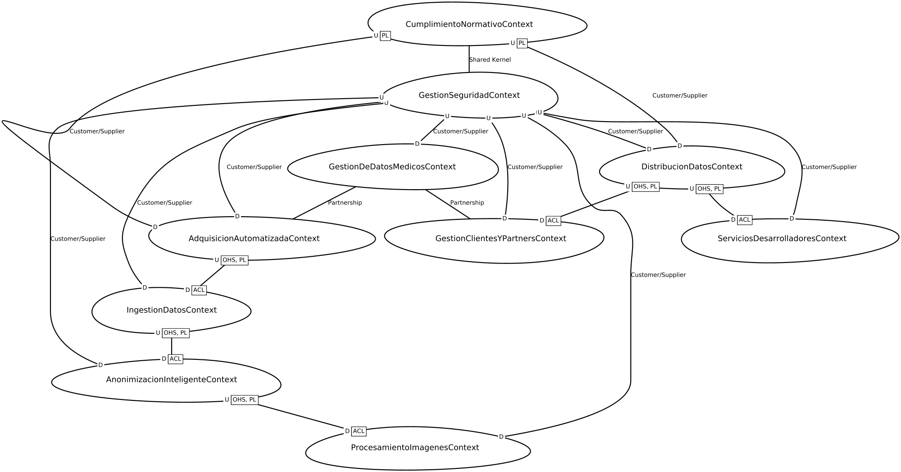

# Diseño y Construcción de Soluciones No Monoliticas

## Nombre del Equipo
XCODE

## Integrantes:
| Nombre | correo | Usuario |
|-|-|-|
| Andres Losada | af.losada@uniandes.edu.co | [AfLosada](https://github.com/AfLosada) |
| Cristian Arias | ca.ariasv1@uniandes.edu.co | [CristianAAV](https://github.com/CristianAAV) |
| Emerson Chaparro | e.chaparroa@uniandes.edu.co | [echaparroa-uniandes](https://github.com/echaparroa-uniandes) |
| Esneider Restrepo | e.restrepoe@uniandes.edu.co | [EsneiderRE](https://github.com/EsneiderRE) |

# Entrega 04
## Escenarios de calidad a probar
- 1: Escenario de calidad: Escalabilidad en la Integración con Sistemas de información de los data partners​
- 3: Escenario de calidad: Procesamiento de 30,000 centros de datos de salud​
- 4: Escenario de calidad: Disponibilidad del API de Autenticación​

## Distribucion del trabajo
| Nombre            | Tarea                     |
|-------------------|----------------------------|
| Andres Losada     | Modulo de Ingestion |
| Andres Losada     | Despliegue GCP |
| Cristian Arias    | Modulo de autorizacion - Api |
| Cristian Arias    | Modulo de autorizacion - SeedWork |
| Cristian Arias    | Despliegue base de datos para autorización |
| Emerson Chaparro  | Modulo BFF |
| Emerson Chaparro  | Modulo de autorizacion - Envio de imagen|
| Esneider Restrepo | Modulo de autorizacion - Validacion de Usuario |
| Esneider Restrepo | Despliegue GCP |

## Estructura del proyecto
Para esta entrega se implementaron los siguientes archivos y carpetas:
- **services/autorizacion:** Servicio para la autorizacion de usuario
- **services/bff:** Implementacion del backend for frontend
- **services/ingestion_datos:** Servicio para la ingestion de archivos e imagenes
- **services/pulsar:** Archivos necesarios para desplegar pulsar en GCP
- **services/seguridad:** Servicion de seguridad de la entrega 1, contiene los modulos de anonimizacion e HIPPA
- **README.md:** Descripcion a instrucciones del proyecto
- **[archivo].Dockerfile:** Archivos necesarios para construir las imagenes utilizadas en el despliegue local o en nube
- **docker-compose.yml:** Orquesta y gestiona los contenedores.
- **requirements.txt:** Define las dependencias necesarias para el proyecto.
- **kubernetes.tf:** Define y gestiona la infraestructura de Kubernetes usando Terraform.

## Ejecutar Aplicación
- Para ejecutar el proyecto localmente , primero levante los contenedores de pulsar y de MySQL con el siguiente comando: 
```
docker compose up -d
```
- Cree el entorno virtual en python con los siguientes comandos: 
```
python3 -m venv venv
source venv/bin/activate
```
- Instale las dependencias de cada componente utilizando esl siguiente comando
```
pip install -r requirements.txt
```
- Ejecucion del Bff:
```
uvicorn bff.main:app --host localhost --port 8005 --reload
```
- Ejecucion del servicio de autorizacion:
```
flask --app autorizacion/api --debug run --port 5001
```
- Ejecucion del  servicio de ingestion:
```
uvicorn ingestion_datos.main:app --host localhost --port 8000 --reload
```
- Ejecucion del servicio de seguridad:
```
flask --app seguridad/api --debug run --port 5002
```
## Request de ejemplo

Para comprobar lo requerido para esta entrega puede ejecutar el siguiente request:

- **Endpoint:** /v1/sta/transaction
- **Método:** POST
- **Headers:** Content-Type='aplication/json'
- **Payload:** 
```
{
    "usuario": "dark-brandon",
    "imagen": "https://upload.wikimedia.org/wikipedia/commons/3/32/Dark_Brandon.jpg",
    "fecha_creacion": "2025-12-12"
}
```

## Entrega 1:
### Dominios y SubDominios
- Ubicacion:  diagramas/DominiosSubdominios.cml
- Link: https://github.com/XCode-MISO/MISW4406-No-Monoliticas/blob/main/diagramas/DominiosSubdominios.cml

### Lenguaje Ubicuo
#### Convencion


#### AS-IS
- Ubicacion:  diagramas/as-is/Event Storming - Lenguaje Ubicuo - AS IS.jpg
- Link: https://github.com/XCode-MISO/MISW4406-No-Monoliticas/blob/main/diagramas/as-is/Event%20Storming%20-%20Lenguaje%20Ubicuo%20-%20AS%20IS.jpg
- Diagrama: 

#### TO-BE
- Ubicacion:  diagramas/to-be/ContextosAcotadosTOBE.png
- Link: https://github.com/XCode-MISO/MISW4406-No-Monoliticas/blob/main/diagramas/to-be/ContextosAcotadosTOBE.png
- Diagrama: 


### Mapas de Contexto
#### AS-IS
- Ubicacion:  diagramas/as-is/ContextosAcotados.cml
- Link: https://github.com/XCode-MISO/MISW4406-No-Monoliticas/blob/main/diagramas/as-is/ContextosAcotados.cml
- Diagrama : 

#### TO-BE
- Ubicacion:  diagramas/as-is/ContextosAcotados.cml
- Link: https://github.com/XCode-MISO/MISW4406-No-Monoliticas/blob/main/diagramas/to-be/ContextoAcotadoTOBE.cml
- Diagrama : 

